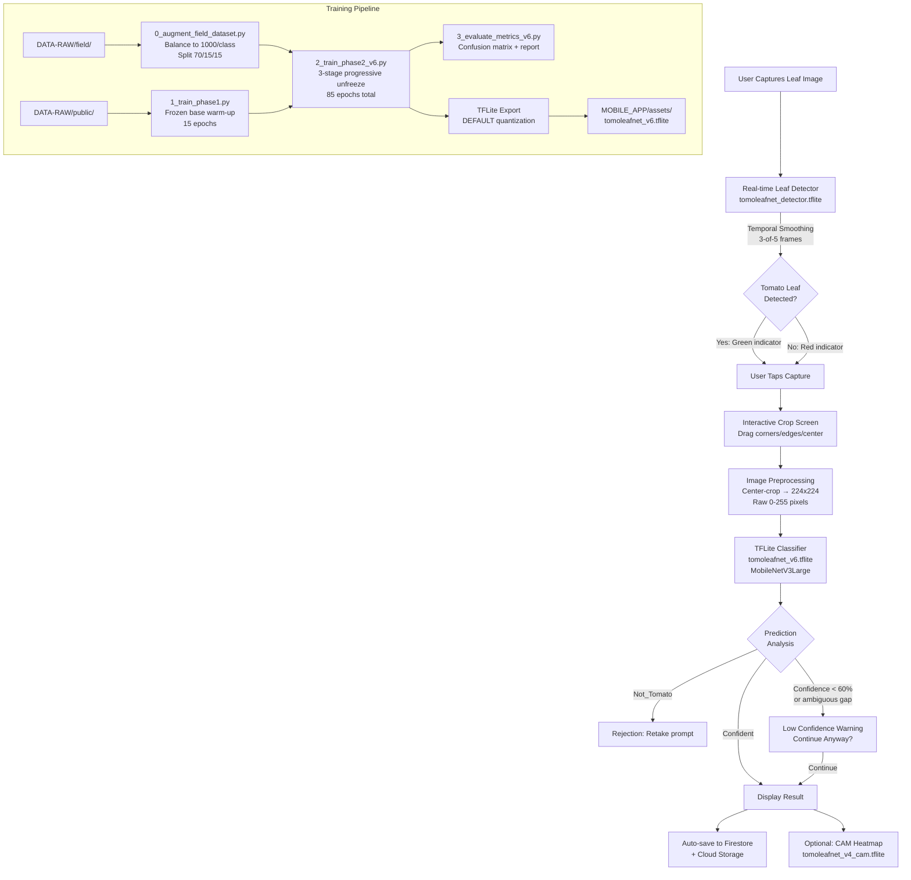

# TomoLeafNet: End-to-End Pipeline Technical Analysis

## 1. System Overview

TomoLeafNet is an on-device tomato leaf disease detection system that combines a two-phase transfer learning pipeline with a Flutter mobile application for real-time inference. The system classifies tomato leaves into five categories: **Early Blight**, **Healthy**, **Leaf Miner**, **Leaf Mold**, and **Not Tomato** (a rejection class for non-tomato-leaf inputs). The entire inference pipeline runs on-device using TensorFlow Lite, requiring no network connectivity for disease classification.

### End-to-End Flow



---

## 2. Dataset Pipeline

### 2.1 Raw Data Sources

| Directory | Purpose | Content |
|-----------|---------|---------|
| `DATA-RAW/field/` | Primary field dataset | Real farm-captured images across 5 classes |
| `DATA-RAW/public/` | Public warm-up dataset | Sourced from Kaggle, 1,000 images/class |

**Current field dataset composition** (v6):

| Class | Real Images | Description |
|-------|------------|-------------|
| Early_Blight | 377 | Field photos of early blight symptoms |
| Healthy | 500 | Reduced from 902 to prevent healthy-class bias |
| Leaf_Miner | 560 | Brightness/contrast adjusted for v6 |
| Leaf_Mold | 386 | Field photos of leaf mold symptoms |
| Not_Tomato | 500 | DTD texture images for rejection filtering |

### 2.2 The Not_Tomato Rejection Class

The `Not_Tomato` class uses images from the Describable Textures Dataset (DTD) — wood grain, fabric, stone, etc. — rather than images of other plant species. This design choice trains the model to reject inputs that lack leaf-like visual features entirely, rather than learning to distinguish between botanically similar species. In practice, this means the model rejects obvious non-leaf inputs (fingers, tables, random objects) while still processing any leaf-like image through the disease classes.

**Tradeoff**: DTD textures are visually distinct from leaves, making the rejection boundary relatively easy to learn. However, the model may misclassify non-tomato leaves (e.g., potato leaves with similar disease symptoms) as one of the disease classes rather than rejecting them. A more robust approach would include actual non-tomato-leaf plant images, but this would require a larger and more carefully curated dataset.

### 2.3 Augmentation and Balancing (`0_augment_field_dataset.py`)

The script reads from `DATA-RAW/field/`, augments each class to exactly **1,000 images**, then performs a stratified split:

| Split | Count/Class | Total | Content |
|-------|------------|-------|---------|
| Train | 700 | 3,500 | Real + synthetic images |
| Val | 150 | 750 | Real images only |
| Test | 150 | 750 | Real images only |

**Critical design decision**: Validation and test splits contain **only real images**. Synthetic augmented images are restricted to the training split. This prevents the model from being evaluated on augmented variants of its own training data, which would inflate accuracy metrics.

**Augmentation pipeline** (applied per-image via `tf.keras.Sequential`):

| Augmentation | Range | Rationale |
|-------------|-------|-----------|
| `RandomFlip` | horizontal only | Leaves have natural vertical orientation; vertical flips would create unrealistic orientations |
| `RandomRotation` | 0.15 (±27°) | Simulates handheld camera angle variation |
| `RandomZoom` | (-0.2, 0.10) | Simulates varying phone-to-leaf distances |
| `RandomTranslation` | 0.15 horizontal & vertical | Simulates off-center framing |
| `RandomContrast` | 0.2 | Simulates lighting variation |
| `RandomBrightness` | 0.2 | Simulates outdoor lighting differences |

---

## 3. Two-Phase Training Pipeline

### 3.1 Phase 1: Warm-Up on Public Data (`1_train_phase1.py`)

**Purpose**: Pre-train the classification head on a large, clean public dataset before fine-tuning on the smaller, noisier field dataset.

**Architecture**:
```
Input (224, 224, 3)
  → MobileNetV3Large (frozen, ImageNet weights)
  → GlobalAveragePooling2D
  → Dropout(0.3)
  → Dense(5, softmax)
```

| Parameter | Value |
|-----------|-------|
| Base model | MobileNetV3Large, `include_top=False`, ImageNet weights |
| Base trainable | **False** (entirely frozen) |
| Optimizer | Adam, lr=1e-3 |
| Loss | CategoricalCrossentropy (no label smoothing) |
| Epochs | 15 |
| Data split | 80/20 train/val from `DATA-RAW/public/` |
| Checkpoint | Best `val_accuracy`, saved as `.h5` then converted to `.keras` |

**Why a separate Phase 1**: The classification head (GAP → Dropout → Dense) starts with random weights. Training it on a large, balanced public dataset (5,000 images) gives the head reasonable initial weights before the more delicate fine-tuning on the smaller field dataset (3,500 images with synthetic augmentation). Without Phase 1, the random head would generate large, noisy gradients during Phase 2's progressive unfreezing, potentially destroying the pretrained base features.

### 3.2 Phase 2: Fine-Tuning on Field Data (`2_train_phase2_v6.py`)

Phase 2 uses **3-stage progressive unfreezing** to adapt the pretrained backbone to the field dataset domain while preserving low-level ImageNet features.

| Stage | Epochs | Unfrozen Layers | Learning Rate | Purpose |
|-------|--------|----------------|---------------|---------|
| Stage 1 | 20 | Last 30 (excl. BN) | 5e-5 | Adapt high-level features |
| Stage 2 | 20 | Last 60 (excl. BN) | 3e-5 | Adapt mid-level features |
| Stage 3 | Up to 45 | All (excl. BN) | 1e-5 | Full model fine-tuning |
| **Total** | **Up to 85** | | | |

**Key training techniques**:

#### BatchNorm Freezing
All `BatchNormalization` layers remain frozen (non-trainable) throughout all three stages. This preserves the running mean and variance statistics learned from ImageNet's 1.2 million images. With only 3,500 training images, unfreezing BN would cause the running statistics to shift toward the small field dataset, making the model less robust to input distribution variation at inference time.

#### Mixup Augmentation (v6: alpha=0.2)
Mixup blends pairs of training images and their labels using a mixing coefficient lambda sampled from a Beta(0.2, 0.2) distribution:

```python
mixed_image = lambda * image_A + (1 - lambda) * image_B
mixed_label = lambda * label_A + (1 - lambda) * label_B
```

The v6 implementation uses proper Beta sampling via two independent Gamma draws (`g1 / (g1 + g2)`), fixing a v4 bug where a single Gamma draw could produce lambda > 1.0, causing loss spikes. Lambda is clamped to `max(lambda, 1-lambda)` to ensure the mixed image is always closer to one of the two source images.

**Rationale**: Mixup provides implicit regularization by training on convex combinations of data points, encouraging linear behavior between training examples. This is particularly valuable when the training set contains synthetic augmented images that may not perfectly represent real-world variation.

#### Additional Field Augmentations (v5/v6)
Two additional augmentations applied with 15% probability each:
- **Random motion blur**: Horizontal convolution kernel (size 3-7) simulating hand shake or wind
- **Random shadow**: Dark rectangular overlay (50-80% darkening) simulating partial shade from nearby plants or structures

#### Cosine Learning Rate with Warmup
Each stage uses a custom `WarmupCosineDecay` schedule:
- **Linear warmup** for the first 2 epochs of each stage (prevents large initial gradients from damaging pretrained features)
- **Cosine decay** from `base_lr` to `min_lr=1e-7` for the remaining epochs

#### Class Weighting
Weights are computed as `total_samples / (num_classes * class_count)` — inversely proportional to class frequency. This compensates for remaining imbalances after augmentation to 1,000 images/class (real vs. synthetic ratio differs per class).

#### Label Smoothing (v5/v6 only)
`CategoricalCrossentropy(label_smoothing=0.1)` — softens hard one-hot labels to `[0.02, 0.02, 0.02, 0.02, 0.92]`, preventing the model from becoming overconfident on potentially noisy synthetic training data.

#### Early Stopping
Stage 3 includes `EarlyStopping(monitor='val_loss', patience=12, restore_best_weights=True)`, which halts training if validation loss doesn't improve for 12 consecutive epochs and restores the weights from the best epoch.

#### CSV Logger
`CSVLogger` writes epoch-level metrics to `RESULTS/Phase2_History_v6.csv`. Because it writes to disk after every epoch, training progress survives crashes or interruptions — a practical safeguard for multi-hour GPU training sessions.

### 3.3 Version Evolution

| Version | Key Changes | Preprocessing |
|---------|-------------|---------------|
| v4 | Baseline: Mixup alpha=0.1, aggressive augmentation, GaussianNoise(0.06), no label smoothing | `preprocess_input` in pipeline |
| v5 | Proper Beta Mixup, label smoothing 0.1, frozen BN, horizontal-only flip, motion blur + shadow | `preprocess_input` in pipeline |
| v6 | **Removed `preprocess_input`** from pipeline, balanced Healthy (500), improved Leaf_Miner | Raw [0,255] — model's built-in Rescaling handles normalization |

**The v5 → v6 preprocessing fix**: The v5 confusion matrix showed 100% of predictions collapsing to `Not_Tomato`. This was caused by **double normalization**: `tf.keras.applications.mobilenet_v3.preprocess_input()` normalizes [0,255] → [-1,1], AND MobileNetV3Large's built-in `Rescaling` layer does the same. Applying both maps all input to approximately [-1.008, -0.992] — effectively constant — causing the model to learn nothing meaningful. v6 removes `preprocess_input` entirely, letting the model's internal Rescaling handle normalization. This also aligns training with the Flutter app, which feeds raw [0,255] pixel values to the TFLite model.

---

## 4. Model Architecture

### 4.1 Why MobileNetV3Large

MobileNetV3Large was selected for three reasons:

1. **Mobile deployment constraint**: The model must run on-device via TFLite with acceptable latency on mid-range Android phones. MobileNetV3Large is specifically designed for mobile inference with inverted residual blocks and squeeze-and-excitation attention.
2. **Feature quality**: Despite being a "mobile" architecture, MobileNetV3Large achieves 75.2% top-1 accuracy on ImageNet — sufficient feature extraction quality for a 5-class fine-tuning task.
3. **Quantization-friendly**: The architecture uses h-swish activation (a piecewise-linear approximation of swish) that degrades gracefully under DEFAULT quantization.

**TFLite model size**: ~3.1 MB after DEFAULT optimization quantization.

### 4.2 Classifier Head Design

```
MobileNetV3Large base output: [batch, 7, 7, 960]
  → GlobalAveragePooling2D: [batch, 960]
  → Dropout(0.3): [batch, 960]
  → Dense(5, softmax): [batch, 5]
```

The head is deliberately simple — a single Dense layer with dropout. This minimizes the number of parameters that must be learned from the small field dataset. The 960-dimensional feature vector from GAP captures sufficient information for a 5-class problem without requiring intermediate dense layers.

**Dropout rate of 0.3**: A moderate rate that provides regularization without excessively suppressing features during training. Combined with Mixup and label smoothing, this creates a multi-layered regularization strategy.

---

## 5. Hyperparameter Summary

### 5.1 Training Hyperparameters

| Parameter | Phase 1 | Phase 2 (v6) |
|-----------|---------|------------|
| Image size | 224 x 224 | 224 x 224 |
| Batch size | 32 | 32 |
| Random seed | 42 | 42 |
| Optimizer | Adam | Adam |
| Loss | CategoricalCrossentropy | CategoricalCrossentropy (label_smoothing=0.1) |
| Total epochs | 15 | Up to 85 (20+20+45) |
| Stage 1 LR | 1e-3 | 5e-5 with cosine decay |
| Stage 2 LR | — | 3e-5 with cosine decay |
| Stage 3 LR | — | 1e-5 with cosine decay |
| Min LR | — | 1e-7 |
| Warmup epochs | — | 2 per stage |
| Mixup alpha | — | 0.2 (Beta distribution) |
| Dropout | 0.3 | 0.3 |
| Early stopping patience | — | 12 (Stage 3 only) |
| BatchNorm | Frozen (base frozen) | Frozen (all stages) |
| Class weights | No | Yes (inverse frequency) |
| Augmentation | No | Yes (horizontal flip, rotation, zoom, etc.) |

### 5.2 Mobile Inference Thresholds

| Parameter | Value | Usage |
|-----------|-------|-------|
| Ambiguity gap | < 0.15 | Top-1 minus top-2 confidence; flags ambiguous predictions |
| Low confidence | < 0.60 | Triggers "Low Confidence" warning before saving |
| Ambiguous flag | gap < 0.15 AND confidence < 0.80 | Combined ambiguity criterion |
| Confident Healthy | >= 0.80 | "Great news!" green result |
| Confirmed Disease | >= 0.85 | "Confirmed" red result |
| Likely Disease | < 0.85 | "Heads up!" orange result |
| Monitor | Healthy < 0.80 | "Keep watch" yellow result |
| Leaf detector threshold | 0.75 | Minimum confidence for "tomato_leaf" label |
| Temporal smoothing | 3-of-5 frames | Recent frame consensus for detector |
| Viewfinder fraction | 0.80 | Crop region as fraction of camera frame width |

---

## 6. Preprocessing Pipeline

### 6.1 The Preprocessing Architecture Decision

**MobileNetV3Large includes a built-in `Rescaling(1/127.5, offset=-1)` layer** as part of its model graph. This layer is the first operation after the input, converting raw [0,255] pixel values to [-1,1] normalized values internally. This is unlike MobileNetV2, where preprocessing must be done externally.

**The v6 pipeline aligns training and deployment by feeding raw [0,255] everywhere**:

| Stage | Input Range | Normalization |
|-------|-----------|---------------|
| Phase 1 training | [0,255] via `image_dataset_from_directory` | `preprocess_input` (no-op or handled by model's Rescaling) |
| Phase 2 v6 training | [0,255] via `image_dataset_from_directory` | **None** — model's Rescaling handles it |
| Phase 2 v6 validation | [0,255] via `image_dataset_from_directory` | **None** — model's Rescaling handles it |
| v6 evaluation | [0,255] via `image_dataset_from_directory` | **None** — model's Rescaling handles it |
| Flutter TFLite inference | [0,255] raw pixel values | **None** — TFLite model's Rescaling handles it |

### 6.2 Center-Crop Geometry

The Flutter preprocessing in `_preprocessImageFile` (`tflite_service.dart:579-624`) applies:

1. **Center-crop to square**: Finds the minimum dimension, crops from center
2. **Bilinear resize** to 224x224 using `img.Interpolation.average`
3. **Pixel extraction**: Raw R, G, B values as `Float32` (no normalization for v6 model; with `/127.5 - 1.0` normalization for v2 model)

The Python training pipeline uses `crop_to_aspect_ratio=True` in `image_dataset_from_directory`, which performs the equivalent center-crop + resize to 224x224. This ensures geometric consistency between training and inference.

### 6.3 Model-Aware Preprocessing

The v6 `tflite_service.dart` supports multiple bundled models via the `TFLiteModelSpec` system:

```dart
static const TFLiteModelSpec mobileNetV3LargeModel = TFLiteModelSpec(
  id: 'tomoleafnet_v6',
  expectsNormalizedInput: false,  // Raw [0,255] — model has Rescaling
);

static const TFLiteModelSpec mobileNetV2Model = TFLiteModelSpec(
  id: 'tomoleafnet_v2',
  expectsNormalizedInput: true,   // Needs manual [-1,1] normalization
);
```

The `expectsNormalizedInput` flag controls whether the preprocessing function applies `pixel / 127.5 - 1.0` normalization. This allows the app to switch between models with different preprocessing requirements without code changes.

---

## 7. Keras-to-TFLite Deployment Path

### 7.1 Export Pipeline

The export process in `2_train_phase2_v6.py` follows this sequence:

1. **Load best checkpoint** from `.h5` (ModelCheckpoint saves during training)
2. **Try native `.keras` export** via `best_model.save(FINAL_KERAS)` — may fail on some TF/Keras version combinations
3. **SavedModel export** via `best_model.export(saved_model_dir)` — creates an intermediate SavedModel in the system temp directory (avoids OneDrive file lock issues on Windows)
4. **TFLite conversion** via `TFLiteConverter.from_saved_model()` with `DEFAULT` optimization
5. **Cleanup**: Remove the temporary SavedModel directory

### 7.2 Quantization

`converter.optimizations = [tf.lite.Optimize.DEFAULT]` applies dynamic range quantization:
- Weights are quantized from float32 to int8 (4x size reduction)
- Activations remain float32 during inference
- Result: ~3.1 MB model file (vs ~12 MB unquantized)

**Risk**: Dynamic range quantization can introduce accuracy degradation, particularly for classes with subtle visual differences. The evaluation script's `compare_tflite()` function measures this by comparing Keras and TFLite predictions on the same test set. A delta > 2% triggers a warning; > 5% triggers a critical alert suggesting float16 quantization instead.

### 7.3 The `.keras` vs `.h5` Fallback

Some TensorFlow/Keras versions pass an unsupported `options=` argument when saving the native `.keras` format. The pipeline handles this with a try/except that falls back to the `.h5` checkpoint. Both Phase 2 training and the evaluation scripts accept either format, checking for `.keras` first, then `.h5`.

---

## 8. Mobile Inference Pipeline

### 8.1 Camera Capture Flow (`camera_screen.dart`)

The camera screen implements a multi-stage pipeline:

1. **Camera initialization**: Back camera, medium resolution, YUV420 format, audio disabled
2. **Real-time leaf detection**: `LeafDetectorService` runs `tomoleafnet_detector.tflite` on camera frames
3. **Temporal smoothing**: 3-of-5 recent frames must agree on "tomato_leaf" before showing the green indicator (prevents transient false positives)
4. **Viewfinder overlay**: Square viewfinder at 80% of screen width with colored corners (green = leaf detected, red = not detected)
5. **Capture**: Takes a still photo, then opens the interactive crop screen
6. **Crop screen**: User can drag corners, edges, or the entire crop box; supports free-form and 1:1 square modes with presets (Fit, Full, 1:1, Reset)
7. **Navigation**: Cropped image goes to either `IdentifyResultScreen` or `DiagnoseResultScreen` based on scan type

### 8.2 Leaf Detector Model (`leaf_detector_service.dart`)

A separate binary classifier (`tomoleafnet_detector.tflite`) runs on camera stream frames to provide real-time feedback:

| Property | Value |
|----------|-------|
| Labels | `not_tomato_leaf`, `tomato_leaf` |
| Threshold | 0.75 confidence for positive detection |
| Input | 224x224, **normalized** [-1,1] via `/127.5 - 1.0` |
| Processing | Crops the viewfinder region from YUV420 camera frame, converts YUV→RGB, bilinear scales |
| Rate | Throttled to one frame every 500ms |

**Note**: The leaf detector uses [-1,1] normalized input (`/127.5 - 1.0`), unlike the v6 disease classifier which uses raw [0,255]. This is because the detector is a separate MobileNetV2-based model without a built-in Rescaling layer. This preprocessing difference is correct and intentional — each model's preprocessing matches its training.

### 8.3 Disease Classification

After cropping, the image is processed through `TFLiteService`:

1. **`preprocessImage()`**: Runs in a background isolate via `compute()` — center-crops to square, resizes to 224x224, extracts pixel values (raw or normalized depending on model spec)
2. **`runInference()`**: Feeds the buffer to the TFLite interpreter, extracts top-1 and top-2 predictions with confidence gap
3. **Result analysis** (in result screens):
   - `Not_Tomato` → Rejection prompt (retake photo)
   - `confidence < 0.60` OR `isAmbiguous` (gap < 0.15 AND confidence < 0.80) → Low confidence warning
   - Otherwise → Display result and auto-save to Firestore

### 8.4 Dual Scan Modes

| Mode | Screen | Features |
|------|--------|----------|
| **Identify** | `IdentifyResultScreen` | Quick result: disease name + confidence + optional "Diagnose This Leaf" upgrade |
| **Diagnose** | `DiagnoseResultScreen` | Full result: disease name + confidence + bilingual diagnostic guide + treatment steps + reminders |

Both modes share the same TFLite inference pipeline but present results differently. The Diagnose mode uses `DiagnosticGuideService` for local bilingual (English/Filipino) disease information, eliminating the need for network connectivity.

---

## 9. CAM Explainability Pipeline

### 9.1 Model Architecture (`4_export_cam_model.py`)

The CAM (Class Activation Mapping) model is **not** a Grad-CAM implementation. It uses the mathematical equivalence between Global Average Pooling followed by a Dense layer and spatial projection of the Dense weights onto the convolutional feature maps.

The dual-output model is constructed by re-wiring the trained classifier:

```
Input (224, 224, 3)
  → MobileNetV3Large base → conv_features [batch, 7, 7, 960]
  ├── → GAP → Dropout → Dense(5) → predictions [batch, 5]
  └── → Dense(5, no_bias, weights=classifier_weights) → cam_maps [batch, 7, 7, 5]
```

The `cam_projection` layer uses the **same weight matrix** as the classifier Dense layer (frozen, non-trainable), applied spatially across the 7x7 feature grid. This produces one 7x7 heatmap per class, showing which spatial regions contribute most to each class prediction.

**Mathematical basis**: For a given class *c*, the CAM at position (i, j) is:

$$CAM_c(i, j) = \sum_k w_{k,c} \cdot f_k(i, j)$$

where $w_{k,c}$ is the classifier weight for channel $k$ and class $c$, and $f_k(i, j)$ is the convolutional feature at position (i, j) in channel $k$. This is equivalent to what `GlobalAveragePooling2D` + `Dense` computes, but preserving spatial information.

### 9.2 Heatmap Generation in Flutter (`tflite_service.dart:332-404`)

1. **Load CAM model** (`tomoleafnet_v4_cam.tflite`) — lazy-loaded on first heatmap request
2. **Detect output indices**: TFLite may reorder outputs; the code identifies predictions ([1,5]) vs CAM maps ([1,7,7,5]) by shape
3. **Extract class-specific CAM**: For the predicted class index, extract the 7x7 spatial map
4. **ReLU + normalize**: `max(0, value)` then divide by the maximum value → [0, 1] range
5. **Bilinear upscale**: Interpolate the 7x7 grid to 224x224 using manual bilinear interpolation in `_buildHeatmapPng`
6. **Color mapping**: HSV colormap (blue → red) blended 40% with the original image (60% original + 40% heatmap)
7. **Encode as PNG** and return as `Uint8List` for display

**Performance**: The CAM is generated with a single forward pass (same cost as normal inference), unlike occlusion sensitivity which requires 16+ separate inferences. The heatmap rendering runs in a background isolate via `compute()` to avoid blocking the UI thread.

### 9.3 Current State

The exported CAM model (`tomoleafnet_v4_cam.tflite`) is based on the **v5 model weights** (as indicated by `4_export_cam_model.py` referencing `tomoleafnet_v5_final.keras`). The v4 in the filename `tomoleafnet_v4_cam.tflite` in the app's assets is the original bundled CAM model. The CAM architecture is model-version-agnostic — it works as long as the base model produces the same 7x7x960 feature maps.

---

## 10. Evaluation Pipeline (`3_evaluate_metrics_v6.py`)

### 10.1 Keras Model Evaluation

1. Loads the test set from `DATA-SPLIT/target_field/test/` (150 real images per class, 750 total)
2. Feeds raw [0,255] images (no `preprocess_input`) — consistent with v6 training
3. Produces:
   - **Classification report**: Per-class precision, recall, F1-score (4 decimal places)
   - **Per-class accuracy**: Individual class accuracy percentages
   - **Confusion matrix**: Dual visualization — raw counts (left) and row-normalized percentages (right)
   - **Overall accuracy**: Macro accuracy across all classes

### 10.2 TFLite Comparison

The `compare_tflite()` function compares Keras and TFLite model outputs on the same test set:
- Runs every test image through both models
- Computes per-sample prediction agreement
- Reports accuracy delta and flags degradation > 2% (quantization issue) or > 5% (preprocessing mismatch)
- Per-class breakdown identifies which classes are most affected by quantization

### 10.3 Learning Curves

If `Phase2_History_v6.csv` exists, the script generates learning curves showing train/val accuracy and loss across all epochs, with vertical lines marking stage boundaries (epoch 20 and 40).

---

## 11. Version Reconciliation

### Current Primary Pipeline (v6)

| Script | Role | Status |
|--------|------|--------|
| `0_augment_field_dataset.py` | Dataset balancing and splitting | Active — dynamic class counts |
| `1_train_phase1.py` | Phase 1 warm-up | Active — reused across versions |
| `2_train_phase2_v6.py` | Phase 2 fine-tuning | **Current** — no `preprocess_input` |
| `3_evaluate_metrics_v6.py` | Evaluation | **Current** — dual confusion matrix |
| `4_export_cam_model.py` | CAM model export | Active — needs update for v6 paths |

### Legacy/Comparison Scripts

| Script | Version | Notes |
|--------|---------|-------|
| `2_train_phase2.py` | v4 | Original baseline (86.53% accuracy); uses `preprocess_input`, aggressive augmentation, single-Gamma Mixup |
| `2_train_phase2_v5.py` | v5 | Fixed Mixup, added label smoothing + frozen BN; still uses `preprocess_input` — produced collapsed confusion matrix |
| `3_evaluate_metrics.py` | v4 | Uses `preprocess_input` in pipeline |
| `3_evaluate_metrics_v5.py` | v5 | Uses `preprocess_input` — produced all-Not_Tomato confusion matrix |
| `SCRIPTS/train.py` | v3 | Legacy 5-class training with custom SpatialAttention/TransformerBlock layers |
| `SCRIPTS/test_gradcam.py` | v3 | Legacy Grad-CAM visualization |
| `SCRIPTS/test_image.py` | v3 | Single-image test script |

### Known Inconsistencies

1. **`4_export_cam_model.py` references v5 paths** (`tomoleafnet_v5_final.keras`). To generate a v6 CAM model, paths need updating to `tomoleafnet_v6_final.keras` and output to `tomoleafnet_v6_cam.tflite`.

2. **Phase 1 preprocessing ambiguity**: `1_train_phase1.py` applies `preprocess_input` in its pipeline. Since Phase 1 freezes the entire base model, and Phase 2 v6 removes `preprocess_input`, the Phase 1 head weights were learned under different preprocessing. However, this is mitigated because Phase 2 completely retrains the head — the Phase 1 head weights serve only as a starting point and converge to new values during fine-tuning.

3. **Leaf detector vs disease classifier preprocessing**: The leaf detector (`tomoleafnet_detector.tflite`) normalizes input to [-1,1] while the disease classifier (`tomoleafnet_v6.tflite`) takes raw [0,255]. Both are correct for their respective model architectures (MobileNetV2 vs MobileNetV3Large with built-in Rescaling), but this asymmetry could cause confusion during maintenance.

4. **App bundles multiple model versions**: `pubspec.yaml` lists `tomoleafnet_v2.tflite`, `v4.tflite`, `v5.tflite`, `v6.tflite`, `v4_cam.tflite`, and `detector.tflite`. Only `v6` and `v2` are selectable in the app's model switcher; the others inflate the APK size unnecessarily.

---

## 12. Critical Analysis

### 12.1 Strengths

**Progressive unfreezing** is well-suited for this problem. The field dataset is small (3,500 training images), and the disease classes share subtle visual features (e.g., Early Blight spots vs Leaf Mold patches). Progressive unfreezing prevents catastrophic forgetting of low-level ImageNet features while allowing high-level feature adaptation.

**The rejection class design** using DTD textures is pragmatic. It effectively filters obvious non-leaf inputs without requiring a curated negative dataset, and the DTD distribution is sufficiently different from leaf textures that the boundary is stable under quantization.

**On-device inference** eliminates network latency and connectivity requirements — critical for agricultural use in rural areas with limited internet access.

**The CAM implementation** is architecturally elegant: zero additional inference cost, no gradient computation, and the heatmap provides genuine spatial interpretability by showing which leaf regions drive the prediction.

### 12.2 Limitations and Risks

**Dataset scale**: 377-560 real images per disease class is small for robust generalization. The model may overfit to specific disease presentations present in the field dataset and fail on novel symptom appearances, different tomato varieties, or different geographic regions.

**Synthetic augmentation ratio**: For Early_Blight (377 real), 623 of 1,000 training images (62%) are synthetic augmentations. While Mixup and geometric augmentations add variety, the synthetic images are ultimately derived from only 77 unique real images (after 150 val + 150 test are held out). This limited source diversity may create subtle correlations in the training set.

**DTD rejection class**: While effective against non-leaf inputs, the Not_Tomato class does not protect against non-tomato leaves or severely damaged leaves that have lost characteristic tomato-leaf morphology. A farmer scanning a potato leaf with Early Blight could receive a false positive "Early Blight" diagnosis.

**Quantization monitoring**: The evaluation script flags Keras vs TFLite accuracy deltas, but does not test edge cases (e.g., images at class boundaries, partially occluded leaves, extreme lighting). Production monitoring of prediction quality is limited to the community contribution service's thumbs-up/thumbs-down feedback.

### 12.3 Thesis Defense Points

1. **Why two-phase training instead of end-to-end?** Phase separation allows the head to learn reasonable feature-to-class mappings on clean public data before being exposed to the noisier, smaller field dataset. This is especially important because the field dataset includes synthetic augmented images that may introduce distribution shift.

2. **Why MobileNetV3Large and not a larger model?** The constraint is on-device inference on mid-range Android phones. MobileNetV3Large provides the best accuracy/latency tradeoff for 224x224 input. Larger models (EfficientNet, ConvNeXt) would require more aggressive quantization, potentially negating their accuracy advantage.

3. **Why CAM instead of Grad-CAM?** CAM via weight projection requires only one forward pass and no gradient computation, making it feasible on mobile devices. Grad-CAM requires backpropagation through the model, which is not supported by TFLite's inference-only runtime. The GAP→Dense architecture makes CAM and Grad-CAM mathematically equivalent for the final convolutional layer.

4. **Why freeze BatchNorm?** With 3,500 training images, updating BN running statistics would make them converge to the training set distribution, reducing robustness to the wider distribution of real-world phone camera images. The ImageNet BN statistics provide a more generalizable normalization baseline.

5. **Why remove `preprocess_input` in v6?** MobileNetV3Large has a built-in Rescaling layer. Applying `preprocess_input` externally double-normalizes the input, mapping all values to a near-constant range and causing model collapse. Removing it aligns training, evaluation, and mobile inference under a single preprocessing protocol: raw [0,255] everywhere.

---

## 13. Conclusion

TomoLeafNet implements a complete pipeline from field image capture to on-device disease classification. The training pipeline uses a two-phase transfer learning strategy — warm-up on public data followed by 3-stage progressive unfreezing on real field images — to adapt MobileNetV3Large's ImageNet-pretrained features to the tomato disease domain with limited training data. Key regularization techniques (Mixup, label smoothing, frozen BatchNorm, class weighting, cosine learning rate) work together to prevent overfitting on the small field dataset.

The mobile application provides a guided capture experience with real-time leaf detection (temporal smoothing for stability), interactive cropping, and multi-tiered result presentation (rejection, low confidence warning, confirmed/likely classification). The CAM explainability pipeline offers spatial interpretability at zero additional inference cost, showing farmers exactly which leaf regions drove the diagnosis.

The v6 iteration resolves a critical preprocessing alignment issue where double normalization caused model collapse, and rebalances the training dataset to reduce healthy-class bias. The entire inference pipeline runs offline, making it deployable in rural agricultural settings without reliable internet connectivity.
